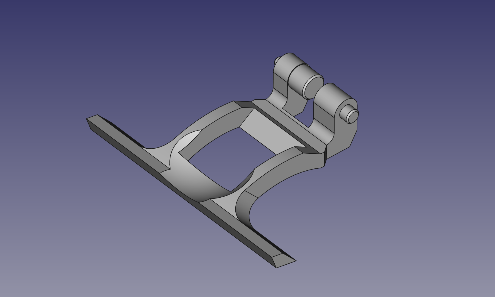

# 3D model of Dyson DC18 pedal plunger part # DY-911099-01

## Files:
* [STL](https://github.com/karl-nilsson/pedal_plunger/raw/master/pedal_plunger.stl)
* [OBJ](https://github.com/karl-nilsson/pedal_plunger/raw/master/pedal_plunger.obj)
* [FreeCAD](https://github.com/karl-nilsson/pedal_plunger/raw/master/pedal_plunger.FCStd)

## Print Settings:
* Material: PLA, ABS, or PETG
* Infill: 100%
* Layer height: 0.1mm
* Supports: Yes

## [Installation Instructions](https://www.youtube.com/watch?v=r0ZaqymChXo)

## License
[CC0](LICENSE)

